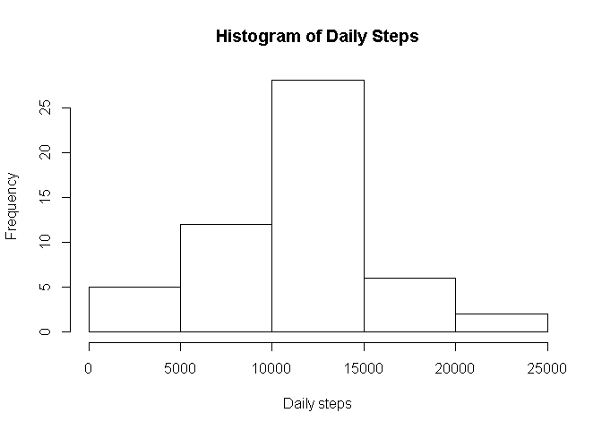
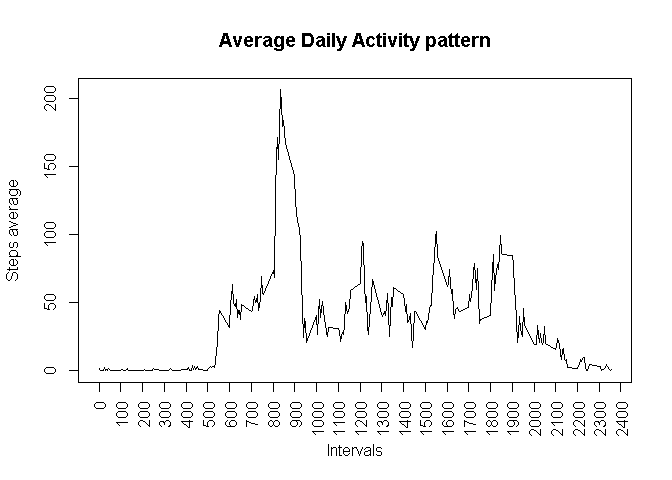
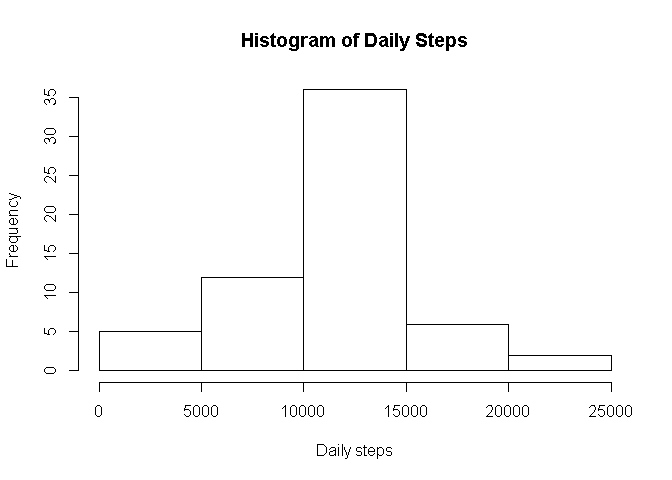
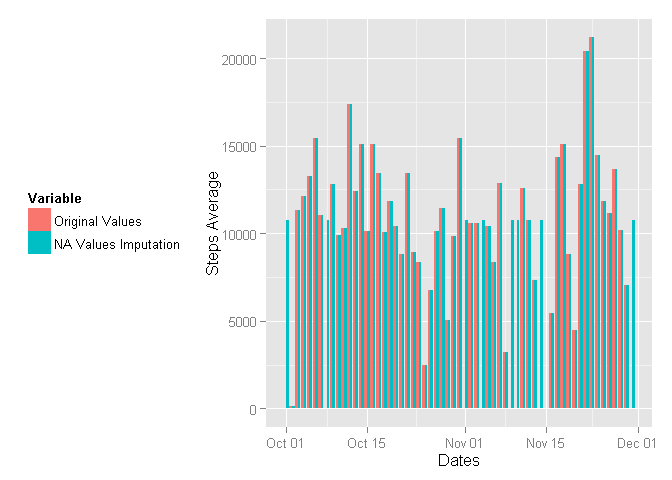

# Reproducible Research: Peer Assessment 1


## Loading and preprocessing the data

```r
activity <- read.csv(unz("activity.zip", "activity.csv"), stringsAsFactors=FALSE, na.strings = "NA")
activity$date <- as.Date(activity$date, format= "%Y-%m-%d")
```


## What is mean total number of steps taken per day?

```r
hist(aggregate(steps ~ date, data = activity, sum)$steps, xlab = "Daily steps", main = "Histogram of Daily Steps")
```

 

```r
options(scipen=2)
StepsMean <- mean(aggregate(steps ~ date, data = activity, sum)$steps)
StepsMedian <- median(aggregate(steps ~ date, data = activity, sum)$steps)
```
The mean of the total number of steps taken by day is 10766.1886792.

The median of the total number of steps taken by day is 10765.

## What is the average daily activity pattern?

```r
library(stringr)
activitymean <- aggregate(steps ~ interval, FUN = mean, data = activity)
activitymean$interval <- as.character(activitymean$interval)
activitymean$interval <- str_sub(paste("000", activitymean[,1], sep = ""), -4)
#activitymean$interval <- format(strptime(activitymean$interval, format="%H%M"), format = "%H:%M")
plot(activitymean$interval, activitymean$steps, type = "l", xaxt = "n", main = "Average Daily Activity pattern", xlab = "Intervals", ylab = "Steps average")
axis(1, xaxp=c("0000", "2400", 24), las=2)
```

 

```r
intervalmaxsteps <- format(strptime(activitymean[which.max(activitymean$steps),1], format="%H%M"), format = "%H:%M")
```
On average, the interval with the maximum number of steps is 08:35.

## Imputing missing values

```r
numberofnas <- nrow(activity[(is.na(activity$steps) | is.na(activity$date) | is.na(activity$interval)),])
## Creating the data set activitywonas with the Activity contents
activitywonas <- activity
## Populating all the missing values with the mean for 5-minute interval calculated previously
activitywonas[is.na(activity$steps),1] <- activitymean$steps
hist(aggregate(steps ~ date, data = activitywonas, sum)$steps, xlab = "Daily steps", main = "Histogram of Daily Steps")
```

 

```r
options(scipen=2)
StepsMeanwoNAs <- mean(aggregate(steps ~ date, data = activitywonas, sum)$steps)
StepsMedianwoNAs <- median(aggregate(steps ~ date, data = activitywonas, sum)$steps)
if (StepsMean != StepsMeanwoNAs) {
  diffMean <- StepsMean - StepsMeanwoNAs
  messageMean <- paste("The missing values imputation impacted the mean calculation in ", diffMean, sep = "")
} else {
  messageMean <- "The missing values imputation did not impact the mean calculation."
}
if (StepsMedian != StepsMedianwoNAs) {
  diffMedian <- StepsMedian - StepsMedianwoNAs
  messageMedian <- paste("The missing values imputation impacted the median calculation in ", diffMedian, sep = "")
} else {
  messageMedian <- "The missing values imputation did not impact the median calculation."
}
```

The number of missing values in the data set is 2304.

The mean of the total number of steps taken by day imputing the missing values is 10766.1886792.

The median of the total number of steps taken by day imputing the missing values is 10766.1886792.

The missing values imputation did not impact the mean calculation.

The missing values imputation impacted the median calculation in -1.1886792452824


```r
library(reshape2)
library(ggplot2)
activitysum <- aggregate(steps ~ date, data = activity, sum, na.action = NULL)
activitysum[, "stepswonas"] <- aggregate(steps ~ date, data = activitywonas, sum)$steps
activitysum.long <- melt(activitysum, id.vars="date")
ggplot(activitysum.long, aes(date, value, fill=variable))+geom_bar(stat="identity",position="dodge") + scale_fill_discrete(name="date", labels=c("W/O Missing Values Imputation", "With Missing Values Imputation")) + labs(x = "Dates", y = "Steps Average")
```

 

## Are there differences in activity patterns between weekdays and weekends?
